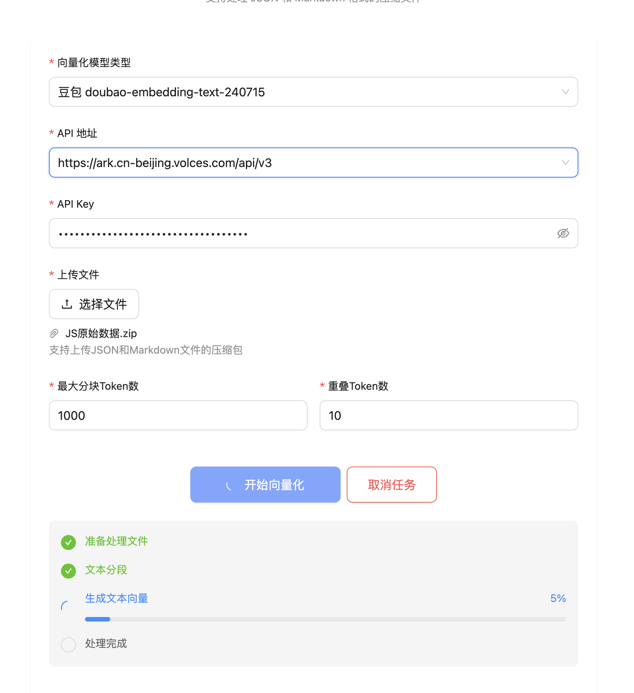

# 文档向量化工具 (Document Vectorization Tool)




## 项目背景

在当今的人工智能和自然语言处理领域，文档的向量化表示已经成为构建高效检索和问答系统的关键基础。本项目旨在提供一个简单易用的文档向量化工具，帮助用户将文本文档转换为向量形式，为后续的文档检索、相似度计算和智能问答等应用提供支持。

## 项目意义

1. **提升检索效率**：通过将文档转换为向量形式，可以实现更快速和准确的文档检索。
2. **支持语义理解**：基于向量的表示方式能够更好地捕捉文本的语义信息。
3. **降低使用门槛**：提供友好的 Web 界面，使非技术用户也能轻松使用向量化功能。
4. **灵活的扩展性**：支持多种模型和配置选项，满足不同场景的需求。

## 功能特性

### 1. 文档处理
- 支持上传 ZIP、RAR、7Z 等压缩格式的文档集合
- 自动解压和处理多个文档
- 支持 JSON 和 Markdown 格式的文本文件

### 2. 向量化配置
- 支持多种向量化模型：
  - 通义千问 text-embedding-v1
  - 豆包 doubao-embedding-text-240715
- 可配置的文本分块参数：
  - 最大分块大小（maxTokensPerChunk）
  - 重叠 Token 数（overlapTokens）

### 3. 任务管理
- 支持多任务并行处理
- 实时进度显示
- 任务状态跟踪
- 支持取消正在运行的任务

### 4. 文件管理
- 自动管理临时文件和工作目录
- 向量化结果的持久化存储
- 支持下载生成的向量文件

## 部署指南

### 环境要求
- JDK 17 或更高版本
- Node.js 16 或更高版本
- Maven 3.6 或更高版本

### 后端部署
1. 克隆项目
```bash
git clone [项目地址]
cd fast-embed
```

2. 编译打包
```bash
./gradlew clean buildAll
```

3. 运行应用
```bash
java -jar fast-embed-1.0.0.jar
```

### 访问应用
启动应用后，通过浏览器访问：
```
http://localhost:18080
```

## 使用流程

1. 打开应用主页面
2. 选择向量化模型和配置参数
3. 上传需要处理的压缩文件
4. 等待处理完成
5. 下载生成的向量文件

## 注意事项

1. 文件大小限制：单个压缩包不超过 100MB
2. 支持的文件格式：JSON 和 Markdown
3. API 密钥：使用模型服务时需要提供有效的 API 密钥
4. 临时文件：处理完成后会自动清理临时文件

## 技术栈

- 后端：Spring Boot
- 前端：React + Ant Design
- 向量化：LangChain4j
- 构建工具：Maven + Vite

## 开发计划

- [ ] 支持更多文档格式
- [ ] 添加批量处理功能
- [ ] 提供向量检索接口
- [ ] 增加用户管理功能
- [ ] 添加向量可视化功能 